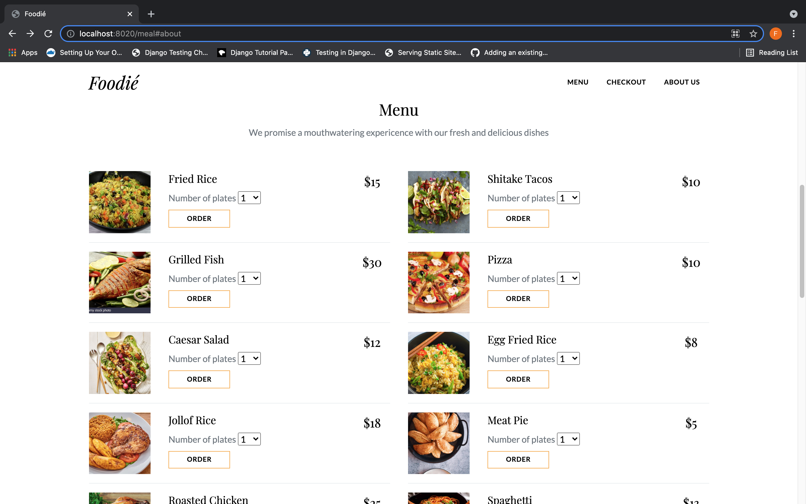
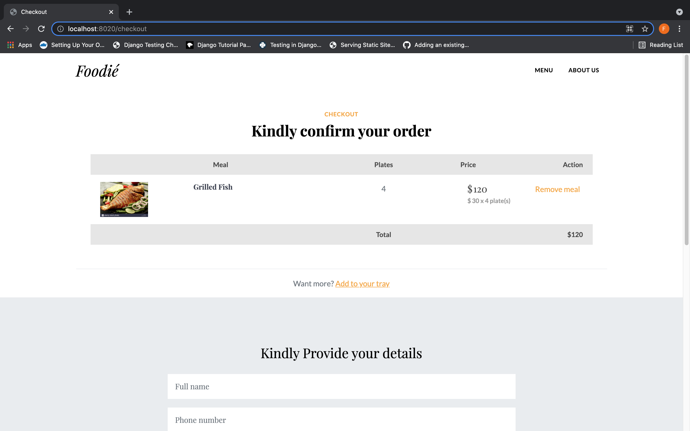

<h1 align="center">
  Foodie
</h1>
<h3 align="center">
  First of its kind online restaurant
</h3>

## Content

<!-- - [Description of Foodie](#what-is-foodie) -->
- [Preview](#preview)
- [Code Usage](#code-usage)


<!-- ## 🤔What is Foodie?
 -->

## Preview
HOMEPAGE
<p>
    
</p>
CHECKOUT PAGE
<p>
    
</p>

## Code Usage
- Clone the repository
- Setup your local environment 

Here is a list of steps to help you get up and running locally using docker ;

- If you do not have docker installed, [please install Docker Desktop](https://www.docker.com/products/docker-desktop). If you are running from a Linux PC, [use Docker Engine](https://docs.docker.com/engine/install).
- [Install Docker Compose](https://docs.docker.com/compose/install/)
- Startup the server and database by running:
  ```shell
  docker-compose -f .docker/dev.docker-compose.yaml up
  ```
- Access local deployment via [http://localhost:8020](http://localhost:8020)
- Takedown the dev setup with:
  ```shell
  docker-compose -f .docker/dev.docker-compose.yaml down
  ```
